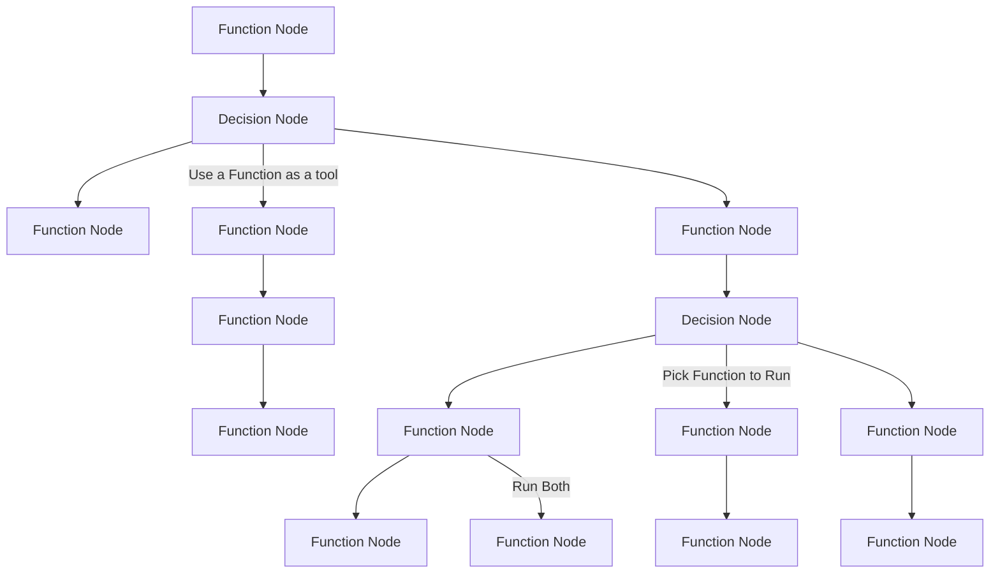

# DAGent - Directed Acyclic Graphs (DAGs) as AI Agents

<p align="center">
  
</p>

*DAGent is an opinionated Python library to create AI Agents quickly without overhead*


## Quickstart

### Installing 
- `pip install dagent` or `rye add dagent`
- Make sure you have the API key of your choice available in system. The default is `OPENAI_API_KEY`


### Get right into it 
See [dagent/examples/quickstart_simple_agent.py](dagent/examples/quickstart_simple_agent.py) for a quickstart example 


### DAGent basics 

The idea behind dagent is to structure AI agents in to a workflow. This is done through setting each function up as a node in a graph. 

The agentic behavior is through the inferring of what function to run through the use of LLMs which is abstracted by a "Decision Node".

`Tool`
- A tool is just a function which the LLM can use. 
- It is helpful to have docstrings and annotations to assist the llm infer what is happening. This is recommended for larger functions/tools. 

`FunctionNode`
- Runs a python function
- Can be attached to a `DecisionNode` to be treated as a tool and allow an LLM to choose which function to run 

`DecisionNode`
- This is where the llm picks a function to run from given options
- The `.compile()` method autogenerates and saves tool descriptions under Tool. Run with param `force_load=True` if there are errors or if an option of tool changes
- These tool/function descriptions get generated under a `Tool_JSON` folder. Feel free to edit tool descriptions if the agent is unreliable.

`prev_output` param for functions:
- If passing data from one function to another, make sure this param is in the function signature.
- If extra params get passed in/weird stuff happens add a `**kwargs` to see if 


### DAGent Diagram


## Using Different Models

DAGent supports using different LLM models for inference and tool description generation. You can specify the model when calling `call_llm` or `call_llm_tool`, or when compiling the DecisionNode.

For example, to use the `groq/llama3-70b-8192` model:

```python

# Using groq with decision node
decision_node1 = DecisionNode('groq/llama3-70b-8192')

# Using ollama with decision node
decision_node2 = DecisionNode('ollama_chat/llama3.1', api_base="http://localhost:11434")

# Call llm function
output = decision_node2.run(messages=[{'role': 'user', 'content': 'add the numbers 2 and 3'}])

```

### Other things to know

- `prev_output` is needed in the function signature if you want to use the value from the prior function's value. Obviously the prior function should have returned something for this to work
- If there are errors with too many params being passed into a function node, add `**kwargs` to your function 
- Args can be overriden at any time using the following (this merges the kwargs in the background with priority to the user):

```python
add_two_nums_node.user_params = {
    # param_name : value
    a : 10
}
```


## Acknowledgements 
Shoutout to:
- [@omkizzy](https://x.com/omkizzy)
- [@kaelan](https://github.com/Oasixer)
